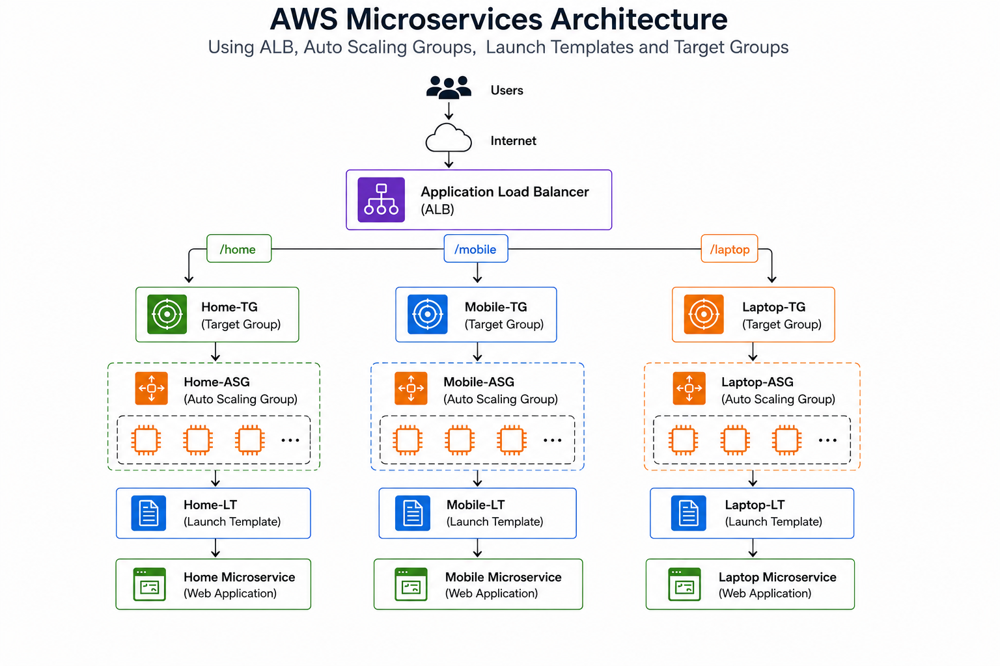

# **Project Introduction**

**AWS Microservices Deployment** is a scalable web application architecture that hosts multiple services independently using Amazon EC2 instances managed through Auto Scaling Groups (ASG) and distributed using an Application Load Balancer (ALB).

This project follows a **microservices architecture**, where each service runs on a dedicated set of EC2 instances launched from separate Launch Templates. The services are managed independently using Auto Scaling Groups and are attached to dedicated Target Groups behind an Application Load Balancer.

The project consists of three services:

* Home Service
* Mobile Service
* Laptop Service

Each service serves its own web page using Apache HTTP Server (httpd) on Amazon Linux instances.

---

# **1. Architecture Overview**

### Architecture Flow



# **2. Launch Templates Configuration**

## **2.1 Home Launch Template**

Name : `Home-LT`

AMI : `Amazon Linux`

Instance Type : `t3.micro`

Security Group : `Launch-Wizard-3`

Key Pair : `Pratik-Virginia-key`

User Data Script :

```bash
#!/bin/bash
yum update -y
yum install -y httpd
systemctl start httpd
systemctl enable httpd

echo "<h1>This is Home Page $(hostname -f)</h1>" > /var/www/html/index.html
```


---

## **2.2 Mobile Launch Template**

Name : `Mobile-LT`

AMI : `Amazon Linux`

Instance Type : `t3.micro`

Security Group : `Launch-Wizard-3`

Key Pair : `Pratik-Virginia-key`

User Data Script :

```bash
#!/bin/bash
yum update -y
yum install -y httpd
systemctl start httpd
systemctl enable httpd

mkdir -p /var/www/html/mobile

echo "<h1>This is Mobile Page $(hostname -f)</h1>" > /var/www/html/mobile/index.html
```


---

## **2.3 Laptop Launch Template**

Name : `Laptop-LT`

AMI : `Amazon Linux`

Instance Type : `t3.micro`

Security Group : `Launch-Wizard-3`

Key Pair : `Pratik-Virginia-key`

User Data Script :

```bash
#!/bin/bash
yum update -y
yum install -y httpd
systemctl start httpd
systemctl enable httpd

mkdir -p /var/www/html/laptop

echo "<h1>This is Laptop Page $(hostname -f)</h1>" > /var/www/html/laptop/index.html
```


---

# **3. Auto Scaling Groups**

## **3.1 Home-ASG**

Launch Template : `Home-LT`

Desired Capacity : `1`

Minimum Capacity : `2`

Maximum Capacity : `4`


---

## **3.2 Mobile-ASG**

Launch Template : `Mobile-LT`

Desired Capacity : `2`

Minimum Capacity : `2`

Maximum Capacity : `2`


---

## **3.3 Laptop-ASG**

Launch Template : `Laptop-LT`


Desired Capacity : `1`

Minimum Capacity : `2`

Maximum Capacity : `4`


---

# **4. Target Groups**

## **4.1 Home Target Group**

Name : `Home-TG`

Protocol : `HTTP`

Port : `80`

Health Check Path : `/`


---

## **4.2 Mobile Target Group**

Name : `Mobile-TG`

Protocol : `HTTP`

Port : `80`

Health Check Path : `/mobile`


---

## **4.3 Laptop Target Group**

Name : `Laptop-TG`

Protocol : `HTTP`

Port : `80`

Health Check Path : `/laptop`


---

# **5. Application Load Balancer Configuration**

Name : `Microservices-ALB`

Type : `Internet Facing`

Protocol : `HTTP`

Listener Port : `80`


---

## **5.1 Listener Rules**

| Path     | Target Group |
| -------- | ------------ |
| /        | Home-TG      |
| /mobile* | Mobile-TG    |
| /laptop* | Laptop-TG    |


---

# **6. Testing the Application**

Access the Application Load Balancer DNS:

```text
http://<Application-LB-1836324107.us-east-1.elb.amazonaws.com>
```

### Home Service

```text
http://<Application-LB-1836324107.us-east-1.elb.amazonaws.com>/
```

Output:
```text
This is Home Page
```


---

### Mobile Service

```text
http://<Application-LB-1836324107.us-east-1.elb.amazonaws.com>/mobile
```

Output:

```text
This is Mobile Page
```


---

### Laptop Service

```text
http://<Application-LB-1836324107.us-east-1.elb.amazonaws.com>/laptop
```

Output:

```text
This is Laptop Page
```


---

# **7. AWS Services Used**

* Amazon EC2
* Launch Templates
* Auto Scaling Groups
* Application Load Balancer
* Target Groups
* Amazon Linux
* Apache HTTP Server
* CloudWatch Metrics
* Dynamic Scaling Policies
* Scheduled Scaling Policies

---

# **8. Conclusion**

This project demonstrates how to build and deploy a scalable microservices architecture on AWS using Launch Templates, Auto Scaling Groups, Target Groups, and an Application Load Balancer. Each service can scale independently, improving availability, fault tolerance, and resource utilization while providing centralized traffic management through the ALB.
